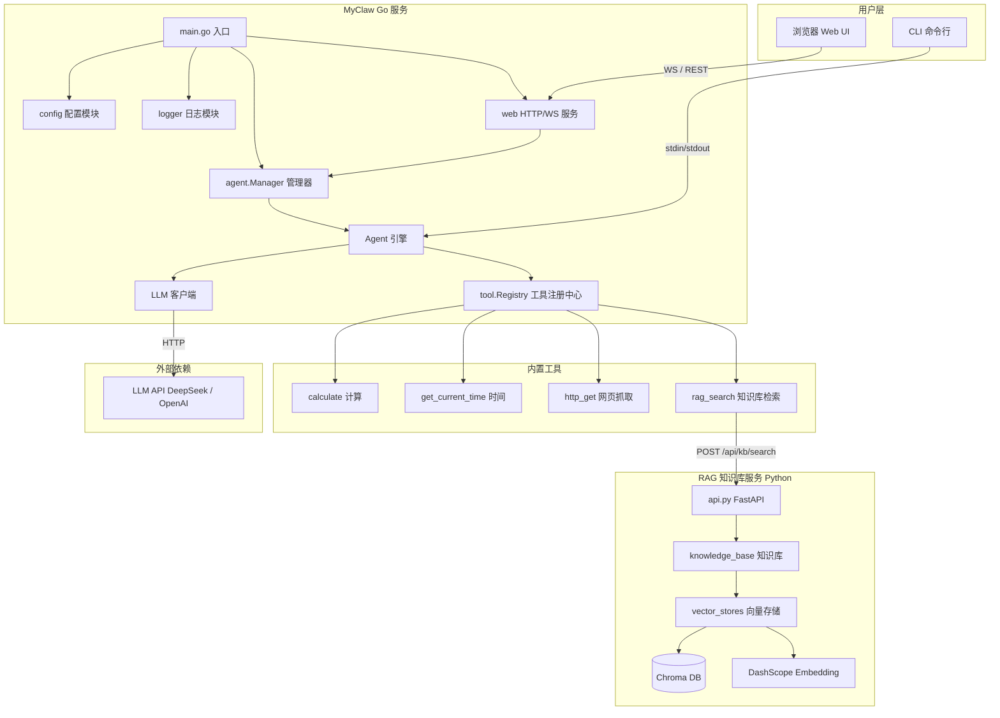
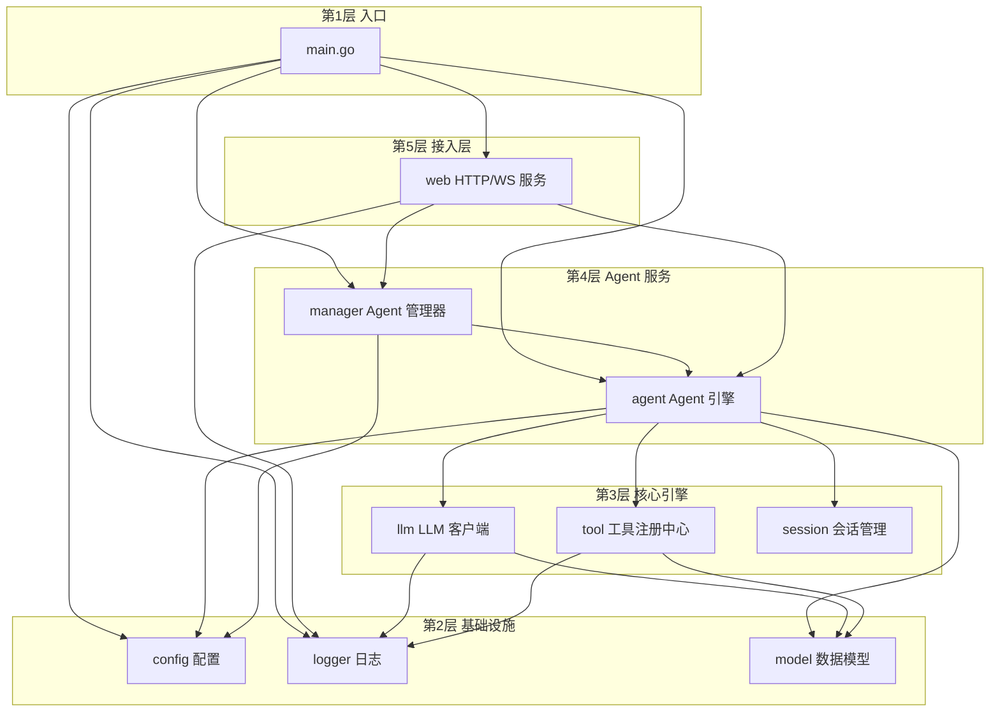
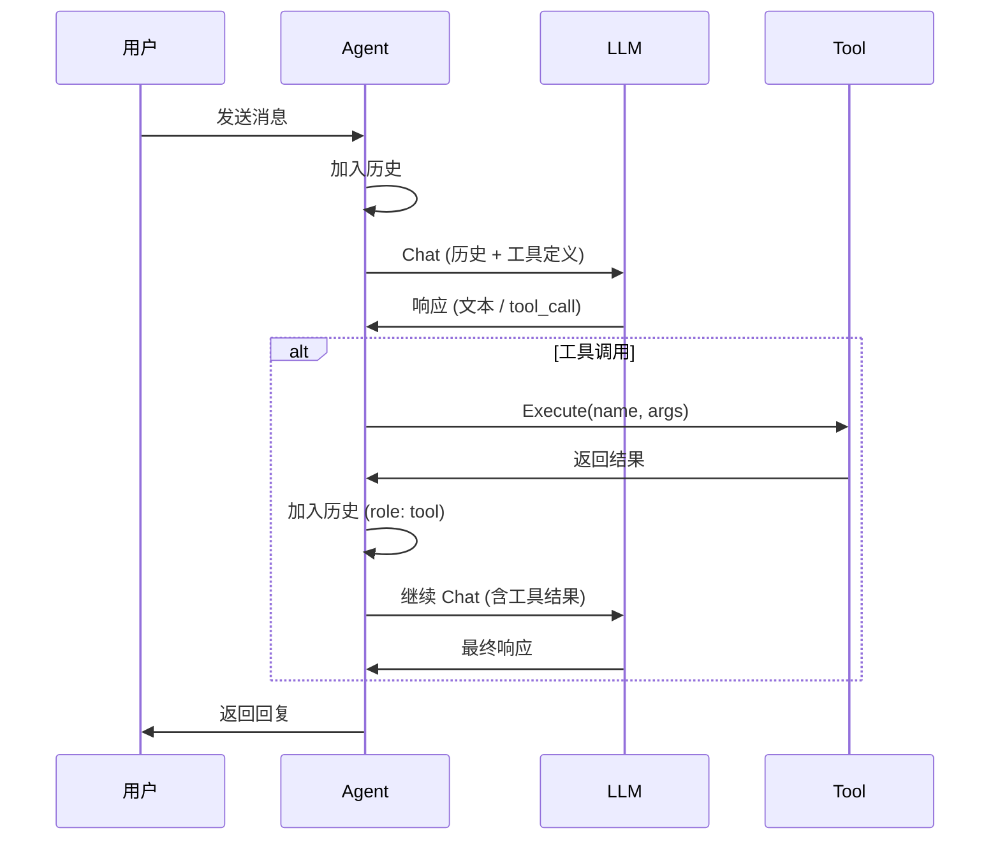
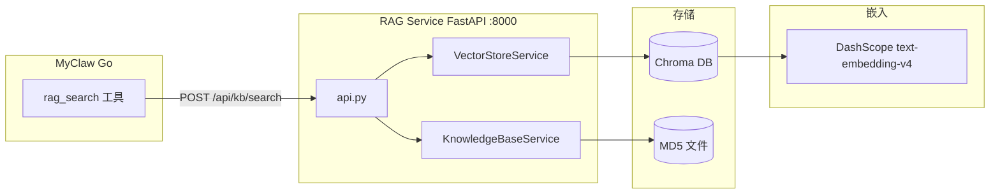
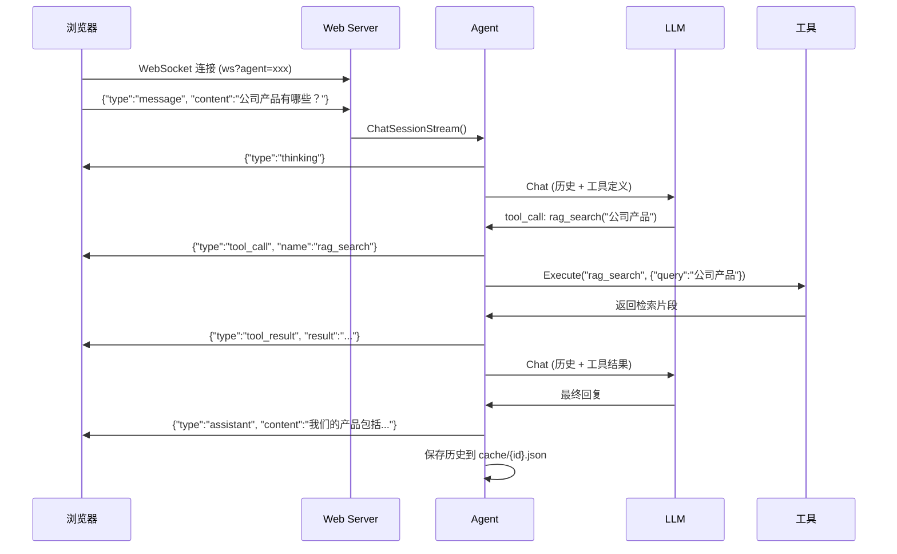

# MyClaw AI 工程架构文档

> 版本: v1.0 | 最后更新: 2026-08-21

---

## 一、项目概述

**MyClaw** 是一个基于 Go 语言的多 Agent AI 对话框架，支持 Function Calling 工具调用和 RAG 知识库检索增强。项目采用模块化分层架构，核心为 Agent 引擎 + 工具注册中心 + LLM 客户端，并搭配 Python FastAPI 构建的 RAG 知识库服务。

| 属性 | 说明 |
|------|------|
| 技术栈 | Go 1.20 + Python 3.10+ (FastAPI/Streamlit) |
| LLM 对接 | OpenAI 兼容 API (当前使用 DeepSeek) |
| 向量数据库 | Chroma (text-embedding-v4 嵌入) |
| 通信协议 | REST API + WebSocket (实时对话) |
| 前端 | 嵌入式 SPA (纯 HTML/CSS/JS) |

---

## 二、整体架构图



---

## 三、分层架构

### 3.1 层间依赖关系



### 3.2 包依赖明细

```
main.go
  ├── internal/config         -- 读取 config.json，环境变量覆盖
  ├── internal/logger         -- 按日期轮转日志，文件+控制台
  ├── internal/tool           -- 注册所有工具 (TimeTool/HTTPTool/CalcTool/RAGTool)
  │     └── internal/model    -- ToolDefinition 等数据模型
  ├── internal/llm            -- 创建 LLM 客户端
  │     ├── internal/logger
  │     └── internal/model    -- ChatRequest/ChatResponse 等
  ├── internal/agent          -- 创建 Manager，管理多 Agent
  │     ├── internal/config   -- AgentConfig
  │     ├── internal/llm      -- 依赖 LLM 客户端
  │     ├── internal/logger
  │     ├── internal/model    -- Message/ToolCall 等
  │     └── internal/tool     -- 依赖工具注册中心
  └── internal/web            -- HTTP + WebSocket 服务
        ├── internal/agent    -- 依赖 Manager/Session
        └── internal/logger
        ├── github.com/google/uuid
        └── github.com/gorilla/websocket
```

---

## 四、核心模块详解

### 4.1 配置模块 (`internal/config`)

负责加载 `config.json` 并支持环境变量覆盖。

```go
type Config struct {
    LLM       LLMConfig          // APIKey, BaseURL, Model
    Agents    []PresetAgentConfig // 预设 Agent 配置
    Log       LogConfig          // 日志目录、级别
    Web       WebConfig          // 是否启用、监听地址
    RAG       RAGConfig          // 是否启用、RAG 服务地址
}
```

**环境变量覆盖优先级**: `MYCLAW_API_KEY` > `MYCLAW_BASE_URL` > `MYCLAW_MODEL` > config.json

### 4.2 数据模型 (`internal/model`)

定义与 LLM API 对齐的核心数据结构：

| 类型 | 用途 |
|------|------|
| `Message` | 对话消息 (Role: system/user/assistant/tool) |
| `ToolCall` | LLM 请求的工具调用 |
| `ToolDefinition` | 工具定义 (含 JSON Schema 参数) |
| `ChatRequest` | LLM 聊天请求体 |
| `ChatResponse` | LLM 聊天响应体 |
| `Usage` | Token 用量统计 |

### 4.3 LLM 客户端 (`internal/llm`)

```go
type Client interface {
    Chat(ctx, messages, tools) → ChatResponse
}

type StreamClient interface {
    Client
    ChatStream(ctx, messages, tools, onChunk)  // SSE 流式
}
```

**关键特性**:
- 支持 OpenAI 兼容 API (BaseURL 可配置)
- SSE 流式解析，增量合并 tool_call
- 指数退避重试 (5xx/429/网络超时，最多 3 次)

### 4.4 Agent 引擎 (`internal/agent`)

Agent 是系统的核心，负责对话循环编排：



**关键函数**:
- `Chat()` — 单轮对话，支持多轮工具调用循环
- `ChatSessionStream()` — 基于独立 Session 的流式对话
- `+()` — Token 预算裁剪，超限时用 LLM 摘要压缩中间历史

### 4.5 Agent 管理器 (`internal/agent/manager.go`)

多 Agent 生命周期管理：

| 功能 | 说明 |
|------|------|
| 配置持久化 | `agents.json` 文件存储 Agent 配置 |
| 历史缓存 | `cache/{agentID}.json` 文件存储对话历史 |
| Agent CRUD | 创建/读取/更新/删除 Agent |
| 子工具注册表 | 每个 Agent 可指定不同的工具子集 |

### 4.6 会话管理 (`internal/agent/session.go`)

```go
type Session struct {
    ID          string    // UUID
    AgentID     string
    History     []model.Message
    SystemPrompt string
    CreatedAt   time.Time
    LastActiveAt time.Time
    MaxTokens   int
}
```

每个 WebSocket 连接创建一个独立 Session，实现会话隔离。SessionManager 后台定期清理过期会话（默认 1 小时）。

### 4.7 工具注册中心 (`internal/tool`)

```go
type Tool interface {
    Name() string
    Description() string
    Parameters() json.RawMessage  // JSON Schema
    Execute(ctx, args) → string
}
```

| 工具 | 名称 | 用途 |
|------|------|------|
| 计算器 | `calculate` | 数学表达式计算 (add/sub/mul/div/pow/sqrt) |
| 时间 | `get_current_time` | 获取当前时间，支持时区 |
| HTTP | `http_get` | 网页内容抓取 (SSRF 防护) |
| RAG | `rag_search` | 知识库检索 (调用 RAG 服务) |

### 4.8 Web 服务 (`internal/web`)

双协议服务：

| 协议 | 路由 | 用途 |
|------|------|------|
| REST | `GET /api/agents` | 列出 Agent |
| REST | `POST /api/agents` | 创建 Agent |
| REST | `PUT /api/agents/:id` | 更新 Agent |
| REST | `DELETE /api/agents/:id` | 删除 Agent |
| REST | `GET /api/tools` | 列出可用工具 |
| WebSocket | `WS /ws?agent=:id` | 实时对话 |

**WebSocket 消息流** (SSE over WebSocket):

```
客户端 → 服务端: {"type":"message", "content":"用户问题"}
服务端 → 客户端: {"type":"thinking"}
服务端 → 客户端: {"type":"tool_call", "name":"rag_search", "args":"..."}
服务端 → 客户端: {"type":"tool_result", "name":"rag_search", "result":"..."}
服务端 → 客户端: {"type":"assistant", "content":"AI回复"}
```

---

## 五、RAG 知识库服务 (Python)

### 5.1 架构



### 5.2 API 接口

| 接口 | 方法 | 说明 |
|------|------|------|
| `/api/health` | GET | 健康检查 |
| `/api/kb/search` | POST | 检索知识库，返回 top-k 相关片段 |
| `/api/kb/documents` | POST | 文档入库 |

### 5.3 检索流程

1. MyClaw 的 `rag_search` 工具调用 RAG 服务
2. RAG 服务使用 DashScope `text-embedding-v4` 将查询向量化
3. Chroma DB 进行向量相似度检索，返回 top-k 片段
4. 结果返回给 LLM，LLM 结合片段生成回答

### 5.4 独立 Streamlit 应用

RAG 系统还包含两个独立的 Streamlit 应用（未与 MyClaw Go 集成）：

| 应用 | 文件 | 用途 |
|------|------|------|
| 聊天 | `app_chat.py` | 基于 LangChain RAG 链的流式聊天 |
| 上传 | `app_upload.py` | 文件上传到知识库 |

---

## 六、数据流

### 6.1 用户提问 → AI 回复



### 6.2 Token 预算裁剪

当历史消息超过 `MaxTokens` 阈值时：

1. 保留 System Prompt
2. 保留最近 1/3 的消息
3. 中间消息调用 LLM 生成摘要压缩
4. 用摘要消息替换中间历史

---

## 七、持久化策略

| 数据 | 存储位置 | 格式 | 说明 |
|------|----------|------|------|
| 配置文件 | `config.json` | JSON | 应用启动配置 |
| Agent 配置 | `agents.json` | JSON | 运行时 Agent 定义持久化 |
| 对话历史 | `cache/{agentID}.json` | JSON | 每个 Agent 的对话历史缓存 |
| 日志 | `log/{YYYY-MM-DD}.log` | 文本 | 按日期轮转 |
| RAG 向量库 | `chroma_db/` | SQLite | Chroma 持久化目录 |
| RAG MD5 | `md5.text` | 文本 | 文档去重校验 |

---

## 八、配置体系

### 8.1 config.json

```json
{
  "llm": {
    "api_key": "sk-xxx",
    "base_url": "https://api.deepseek.com/v1",
    "model": "deepseek-chat"
  },
  "web": {
    "enable": true,
    "addr": ":8080"
  },
  "rag": {
    "enable": true,
    "base_url": "http://127.0.0.1:8000",
    "top_k": 4
  },
  "log": {
    "dir": "log",
    "level": "info",
    "to_console": true
  }
}
```

### 8.2 agents.json

```json
[
  {
    "id": "default",
    "name": "MyClaw",
    "model": "deepseek-chat",
    "system_prompt": "你是一个智能助手...",
    "max_turns": 10,
    "tools": ["calculate", "get_current_time", "http_get", "rag_search"]
  }
]
```

---

## 九、前端架构

单页应用 (SPA)，嵌入式在 Go 二进制中 (`//go:embed static`)。

| 模块 | 说明 |
|------|------|
| 侧边栏 | Agent 列表，创建/编辑/切换 |
| 对话区 | 消息气泡，Markdown 渲染，代码高亮 |
| 输入区 | 文本输入，快捷键支持 |
| 工具卡片 | 可折叠的工具调用/结果展示 |
| 模态框 | Agent 创建/编辑表单 |

**依赖库**: marked.js (Markdown 渲染) + highlight.js (代码高亮) — CDN 加载。

---

## 十、部署与运行

### 10.1 启动方式

```bash
# 1. 启动 RAG 服务 (Python)
cd KnowledgeBase-RAG-LLM-System
pip install -r requirements.txt
python api.py              # FastAPI :8000

# 2. 启动 MyClaw (Go)
cd e:\project\myagent
go run .                   # HTTP :8080

# 3. 打开浏览器
open http://localhost:8080
```

### 10.2 项目结构

```
myagent/
├── main.go                        # 应用入口
├── go.mod / go.sum                # Go 模块依赖
├── config.json                    # 应用配置
├── agents.json                    # Agent 配置持久化
├── Makefile                       # 构建脚本
├── README.md                      # 项目说明
├── docs/
│   ├── architecture.md            # 本文档
│   └── rag-integration.md         # RAG 集成方案
├── bin/                           # 编译输出
├── cache/                         # 对话历史缓存
├── log/                           # 运行日志
├── internal/
│   ├── agent/                     # Agent 核心
│   │   ├── agent.go               # 对话引擎
│   │   ├── event.go               # 事件类型
│   │   ├── manager.go             # 多 Agent 管理器
│   │   └── session.go             # 会话管理
│   ├── config/                    # 配置加载
│   ├── llm/                       # LLM 客户端
│   ├── logger/                    # 日志系统
│   ├── model/                     # 数据模型
│   ├── tool/                      # 工具注册中心
│   │   ├── calc_tool.go           # 计算工具
│   │   ├── http_tool.go           # HTTP 工具
│   │   ├── rag_tool.go            # RAG 检索工具
│   │   ├── registry.go            # 注册中心
│   │   └── time_tool.go           # 时间工具
│   └── web/                       # Web 服务
│       ├── handler.go             # HTTP + WS 处理
│       └── static/                # 前端静态文件
└── KnowledgeBase-RAG-LLM-System/  # Python RAG 服务
    ├── api.py                     # FastAPI 服务
    ├── knowledge_base.py          # 知识库核心
    ├── vector_stores.py           # 向量存储封装
    ├── rag.py                     # LangChain RAG 链
    ├── app_chat.py                # Streamlit 聊天
    ├── app_upload.py              # Streamlit 上传
    ├── config_data.py             # RAG 配置
    ├── file_history_store.py      # 对话历史文件存储
    └── chroma_db/                 # 向量数据库持久化
```

---

## 十一、设计决策

| 决策 | 选择 | 理由 |
|------|------|------|
| 会话隔离 | 独立 Session 对象 | 每个 WebSocket 连接独立历史，互不干扰 |
| 历史压缩 | LLM 摘要 | 超过 Token 预算时压缩中间历史，保留上下文 |
| 工具调用折叠 | `<details>` 可折叠 | 减少工具调用对对话流的视觉干扰 |
| SSRF 防护 | 禁止内网/私有地址 | HTTP 工具的安全防护 |
| 配置覆盖 | 环境变量 > 配置文件 | 便于 Docker/K8s 部署 |
| RAG 架构 | 独立服务化 | 解耦，Python 生态更适合 AI 任务 |
| 前端嵌入 | `//go:embed` | 单二进制部署，无外部依赖 |

--- 

## 十二、扩展指南

### 新增工具

1. 在 `internal/tool/` 下创建新文件，实现 `Tool` 接口
2. 在 `main.go` 的 `registry.Register()` 中注册
3. 工具会自动出现在前端"工具选择"列表中

### 新增 Agent 类型

1. 在 `config.json` 的 `agents` 数组中添加预设配置
2. 或在 Web UI 中直接创建新 Agent
3. 可指定不同的模型、System Prompt 和工具子集

### 切换 LLM 提供商

修改 `config.json` 中的 `base_url` 和 `model` 字段，确保 API 兼容 OpenAI 格式即可。